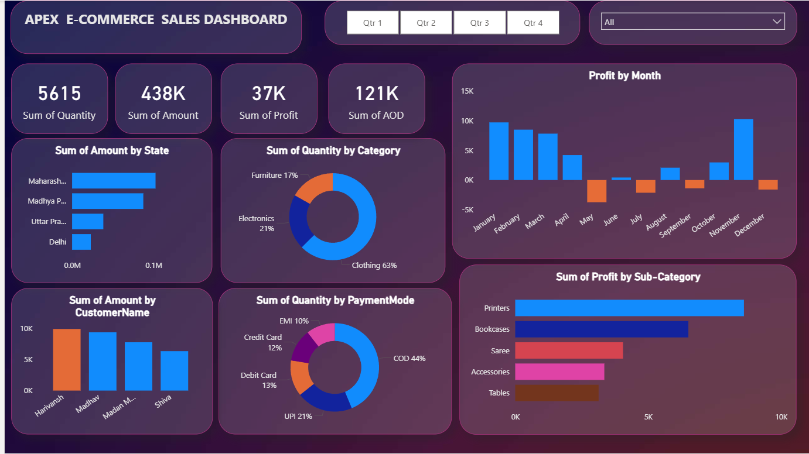

# 📊 Power BI

# 🛒 Apex E-Commerce Sales Dashboard

An interactive Power BI dashboard designed to track and analyze online sales performance across India.  
The dashboard provides dynamic insights into revenue, profit, customer behavior, state-wise trends, and product performance.

---

## 🚀 Features

- 📈 KPI Cards (Revenue, Profit, Quantity, AOV)
- 🌍 State-wise Sales Analysis
- 🗓️ Monthly Profit Trend
- 🛍️ Category & Sub-Category Performance
- 💳 Payment Mode Distribution
- 👥 Top Customers by Revenue
- 🎛️ Interactive Quarter & Category Filters

---

## 📷 Dashboard Preview

  

---
## 🎥 Interactive Dashboard Demo

  

## 🛠️ Tools & Skills Used

- Power BI
- DAX (Data Analysis Expressions)
- Data Modeling & Relationships
- Data Cleaning
- Business Intelligence Reporting
- Interactive Dashboard Design

---

## 👤 Author

**Made by Ruwab Aziz**

🔗 LinkedIn:  
https://www.linkedin.com/in/ruwabaziz/
